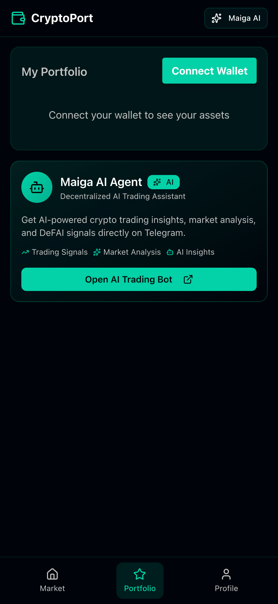
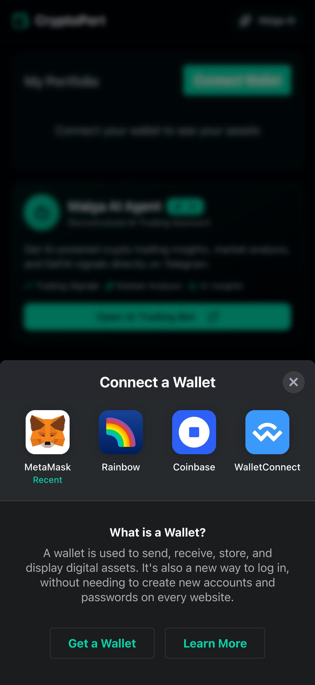

# CryptoPort - Crypto Portfolio Tracker

<div align="center">


</div>

A mobile-first cryptocurrency portfolio tracker built with Next.js 15, featuring Web3 wallet integration and real-time token price tracking.

## 📸 Screenshots

### Mobile Views

<div align="center">
  <table>
    <tr>
      <td align="center">
        
        <br />
        <sub><b>Portfolio - Not Connected</b></sub>
      </td>
      <td align="center">
        
        <br />
        <sub><b>Portfolio - Connected</b></sub>
      </td>
      <td align="center">
        
        <br />
        <sub><b>Wallet Connection</b></sub>
      </td>
    </tr>
    <tr>
      <td align="center">
        <br />
        
        <br />
        <sub><b>Market View</b></sub>
      </td>
      <td align="center">
        <br />
        
        <br />
        <sub><b>Profile Page</b></sub>
      </td>
    </tr>
  </table>
</div>

## 🚀 Features

- **🔐 Wallet Connection** - Seamless wallet integration with RainbowKit (MetaMask, WalletConnect, and more)
- **💰 Portfolio Tracking** - Real-time token balances powered by Alchemy SDK
- **📊 Live Market Data** - Up-to-date cryptocurrency prices from CoinGecko API
- **📱 Mobile-First Design** - Responsive layout optimized for mobile devices
- **⚡ Real-time Updates** - Automatic data refresh with intelligent caching
- **🎨 Modern UI** - Clean interface with shadcn/ui components and dark theme support
- **🔒 Secure Authentication** - Sign-In with Ethereum (SIWE) support

## 🛠 Tech Stack

### Core Framework

- **Next.js 15.5** - React framework with App Router & Turbopack
- **React 19** - Latest React with concurrent features
- **TypeScript 5** - Type-safe development

### Styling & UI

- **TailwindCSS 4** - Utility-first CSS framework
- **shadcn/ui** - Beautiful, accessible component library
- **Radix UI** - Headless UI primitives
- **Lucide React** - Icon library

### Web3 Integration

- **Alchemy SDK** - Blockchain API and node infrastructure
- **wagmi 2.18** - React Hooks for Ethereum
- **RainbowKit 2.2** - Wallet connection UI with SIWE support
- **Ethers 6** - Ethereum library for blockchain interactions
- **Viem** - TypeScript Ethereum interface

### State & Data Management

- **Jotai** - Atomic state management
- **TanStack React Query 5** - Server state & caching management

## 🏃‍♂️ Getting Started

1. **Install dependencies:**

   ```bash
   pnpm install
   ```

2. **Set up environment variables:**
   Create a `.env.local` file and add:

   ```env
   NEXT_PUBLIC_WALLETCONNECT_PROJECT_ID=your-walletconnect-project-id
   NEXT_PUBLIC_ALCHEMY_API_KEY=your-alchemy-api-key
   NEXT_PUBLIC_ALCHEMY_API_URL=https://api.g.alchemy.com
   NEXT_PUBLIC_COIN_GECKO_API_URL=https://api.coingecko.com/api/v3
   ```

   - **WalletConnect Project ID**: Get from [WalletConnect Cloud](https://cloud.walletconnect.com/)
   - **Alchemy API Key & URL**: Get from [Alchemy Dashboard](https://dashboard.alchemy.com/)
     - The URL depends on your network (e.g., `eth-mainnet`, `eth-sepolia`, `polygon-mainnet`)
   - **CoinGecko API URL**: Use the free public API or get a key from [CoinGecko](https://www.coingecko.com/en/api)

3. **Run the development server:**

   ```bash
   pnpm dev
   ```

4. **Open [http://localhost:3000](http://localhost:3000)** in your browser

## 📱 Usage

### Connecting Your Wallet

<div align="center">
  
</div>

1. **Connect Wallet** - Click the "Connect Wallet" button to connect your Web3 wallet
2. **View Portfolio** - See your token holdings and total portfolio value
3. **Track Performance** - Monitor 24h price changes and portfolio performance

### Navigation

The app features a mobile-first bottom navigation with three main sections:

- **Portfolio** - View your holdings and total balance
- **Market** - Browse trending cryptocurrencies and market data
- **Profile** - Manage your settings and wallet connection

## 🔧 Configuration

The app integrates with multiple blockchain data providers:

- **Alchemy SDK** - Fetches real-time wallet balances and token holdings
- **CoinGecko API** - Provides live cryptocurrency prices and market data
- **Ethereum Networks** - Supports multiple networks via wagmi configuration
- **Real-time Updates** - Automatic data refresh with React Query caching

## 📁 Project Structure

```
crypto-port/
├── public/             # Static assets
├── screenshots/        # Project screenshots for README
├── src/
│   ├── app/           # Next.js app router
│   │   ├── market/    # Market page
│   │   ├── profile/   # Profile page
│   │   └── page.tsx   # Home/Portfolio page
│   ├── components/    # React components
│   │   ├── ai/        # AI trading features
│   │   ├── layout/    # Layout components (Header, Navigation)
│   │   ├── market/    # Market-related components
│   │   ├── portfolio/ # Portfolio-related components
│   │   ├── tokens/    # Token display components
│   │   ├── ui/        # shadcn/ui components
│   │   └── wallet/    # Wallet components
│   ├── config/        # Configuration files (wagmi, etc.)
│   ├── hooks/         # Custom React hooks
│   ├── services/      # API services (Alchemy, CoinGecko)
│   ├── store/         # Jotai state management
│   ├── types/         # TypeScript type definitions
│   └── utils/         # Utility functions
└── ...config files
```

## 📝 License

MIT License - feel free to use this project for learning and development!
